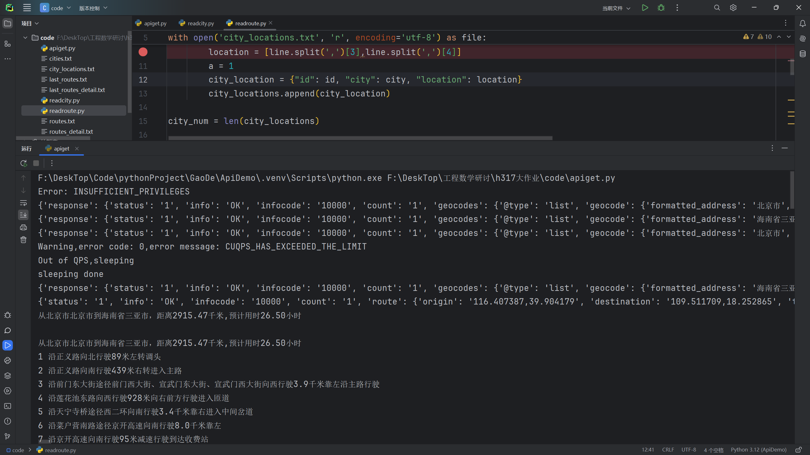
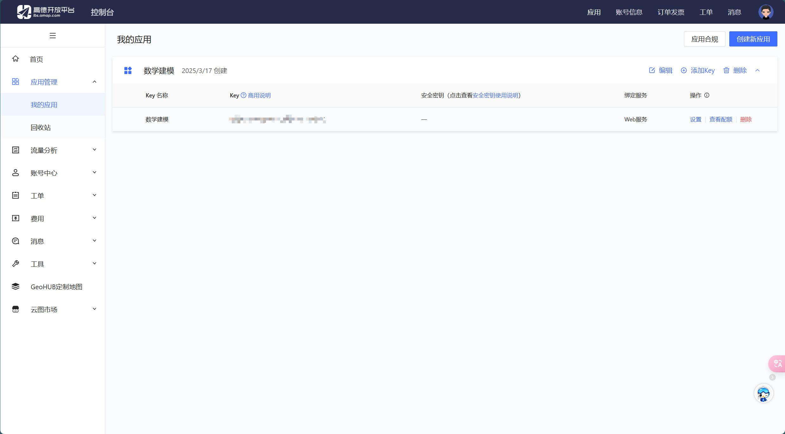
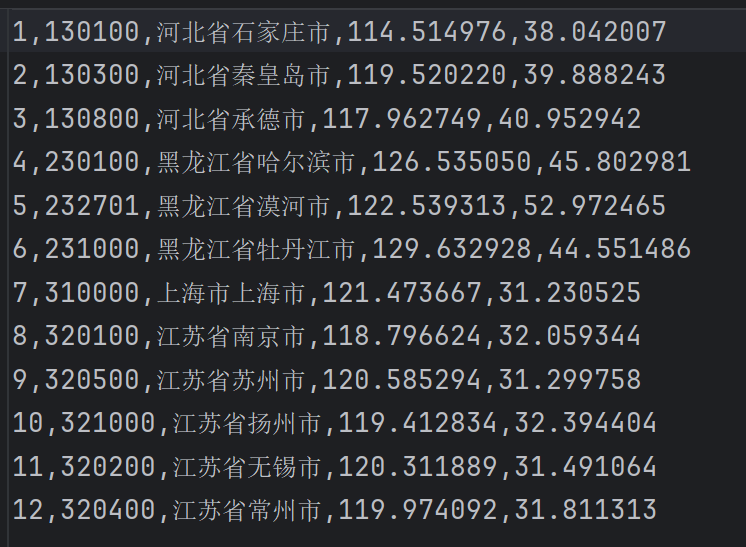

# GaodeAPI

--- 
南京航空航天大学《工程数学研讨A》大作业辅助程序

---
## 功能说明：
- 通过使用免费的高德开放平台开发者API key获取地理信息
- 实现了了限制过量的并发访问和报错记录

## 实现的函数包括：
1. 地理/逆地理编码 
2. 城市位置查询 
3. 两点间路线查询，包括距离和详细路线

   示例：

## 使用教程：
### Part1：Get API Key
1. 去高德开放平台注册一个账号，并且申请一个web api
   - 官网：https://console.amap.com/dev/index
   - 在这个界面注册
   
   - 打码部分就是需要的key
2. 将这个key复制到 [apiget.py](apiget.py)(7:15)中的my_api_key变量中
3. 允许当前脚本，如果输出如上图就是可以成功访问

### Part2:GetCities Geocode
1. 首先需要一个城市名单，示例如[cities.txt](cities.txt)（xx地区可以不需要）
这部分可以让AI***按照你的想法***生成，格式如果一致可以直接访问，如果不一致就需要自己调一调代码了
2. 运行[readcity.py](readcity.py),如果顺利的话，会生成一个如下图的名为city_locations文件
这个文件是输入的城市的地理编码信息
   
3. 运行[readroute.py](readroute.py)，顺利的话会出现两个文件：routes.txt和routes_detail.txt
一个存放的是路线的距离，另一个是详细信息

---
***[apiget.py](apiget.py)中的函数location2route(line 95)有n多个参数可以写***，详情见 https://lbs.amap.com/api/webservice/guide/api/newroute

# 本项目遵循GPL协议，请将改进的代码发布。

dcy2025# GaoDeAPI
